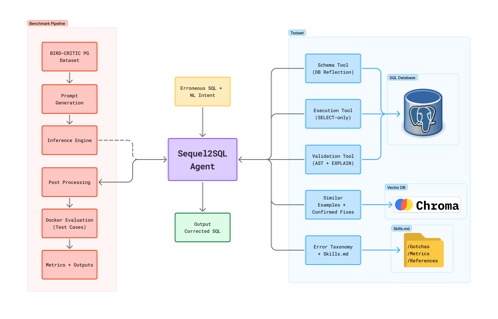

# Sequel2SQL

<p align="center">
    <picture>
        <source media="(prefers-color-scheme: dark)" srcset="assets/logo-dark.png">
        
    </picture>
    <br>An agentic LLM + RAG framework for PostgreSQL error diagnosis, optimization, and correction.
</p>

---

<p align="center">
    <a href="https://github.com/SVijayB/sequel2sql/pulls">
        
    </a>
<a href="https://github.com/SVijayB/sequel2sql/issues">
    
    </a>
<a href="https://github.com/SVijayB/sequel2sql/graphs/contributors">
    
    </a>
<a href="https://github.com/SVijayB/sequel2sql/blob/master/LICENSE">
    
    </a>
<a href="https://github.com/SVijayB/sequel2sql">
    
    </a>
<a href="https://github.com/SVijayB/sequel2sql/blob/master/.github/CODE_OF_CONDUCT.md">
    
    </a>
<a href="https://github.com/SVijayB/sequel2sql/blob/master/.github/CONTRIBUTING.md">
    
    </a>
</p>

## 🗺️ Map

- [<code>📖 Motivation</code>](#-motivation)
- [<code>📦 Installation</code>](#-installation)
- [<code>🚀 Usage</code>](#-usage)
- [<code>🧪 Benchmark</code>](#-benchmark)
- [<code>🤝 Contributing</code>](#-contributing)
- [<code>📝 License</code>](#-license)

## 📖 Motivation

$$\color{#00BFFF}Purpose$$

Many  AI  tools  excel  at  generating  SQL  (NL2SQL), however  they  still  struggle  to  reliably  fix  broken queries in real-world database environments. In practice, data engineers and analysts spend a significant  portion  of  their  time  debugging  issues such  as  syntax  errors,  incorrect  joins,  hallucinated columns, aggregation mistakes, and schema mismatches.  

Generic  large  language  models  often lack  the  database  context,  validation  mechanisms, and  reliability  required  to  correct  SQL  queries  and often, fail to address the problem. We built an intelligent system focused on PostgreSQL error correction, and query optimization.

This project started as a capstone for the MS in Data Science program at the University of Washington, Seattle, sponsored by Microsoft and guided by [Dhruv Relwani](https://www.linkedin.com/in/dhruvrelwani/).

$$\color{#00BFFF}Features \space \color{#56565E}Included$$

- Modular agentic archiecture with a plug and play model-agnostic design.
- Deterministic AST-based SQL validation with error classification.
- Live PostgreSQL schema inspection and read-only query execution tools.
- Retrieval of similar query-intent examples through local ChromaDB.
- Storage and reuse of previously confirmed SQL fixes per database.
- Domain-specific semantic model skills for previously seen databases.
- Interactive setup flow, web UI, and benchmark runner

<p align="center">
    
    Flowchart illustrating the Sequel2SQL agent's reasoning process, tool usage, and retrieval components.
</p>

$$\color{#00BFFF}Quick \space \color{#56565E}Start$$

If you want the fastest path to a working local setup, clone the repo, install dependencies with `uv`, configure `.env`, and launch the guided setup script:

```bash
git clone https://github.com/SVijayB/sequel2sql
cd sequel2sql
uv sync
cp .env.example .env
uv run python setup.py
```

The setup script checks prerequisites, helps configure API keys, can start Docker services, and verifies database connectivity.

## 📦 Installation

$$\color{#00BFFF}Clone \space \color{#56565E}Repository$$

```bash
git clone https://github.com/SVijayB/sequel2sql
cd sequel2sql
```

$$\color{#00BFFF}Install \space \color{#56565E}Prerequisites$$

This project uses [uv](https://github.com/astral-sh/uv) for fast, reliable Python package management. Install it with:

```bash
pip install uv
```

You would also need Docker installed and running to use the PostgreSQL database and run the benchmark, you can download it from [here](https://www.docker.com/products/docker-desktop/) or use your system's package manager.

$$\color{#00BFFF}Setup \space \color{#56565E}Environment$$

Create a virtual environment and install all requirements:

```bash
uv sync
```

Before running the app, create your environment file:

```bash
cp .env.example .env
```

Then update `.env` with the relevant values:

- `GOOGLE_API_KEY` for Gemini from [Google AI Studio](https://aistudio.google.com/api-keys)
- `MISTRAL_API_KEY` for Mistral from [Mistral AI](https://console.mistral.ai/home?profile_dialog=api-keys)
- `DATABASE` for the name of the PostgreSQL database to connect to in the web UI (make sure it matches your Docker setup).
- `DEFAULT_MODEL` for the default agent model (Gemini 3 Flash or Mistral Large are already configured)
- `LOGFIRE_TOKEN` if you want tracing through Logfire from [Pydantic Logfire](https://pydantic.dev/logfire)

Once your environment is configured, run the interactive setup script to verify everything is working and to run any necessary initialization steps:

```bash
uv run python setup.py
```

The setup script also supports:

```bash
uv run python setup.py --help
```

```text
usage: setup.py [-h] [--benchmark] [--skip-docker] [--skip-prompts] [--api-key API_KEY] [--check-only]

options:
  --benchmark        Setup for full benchmark (includes data validation)
  --skip-docker      Skip Docker container setup
  --skip-prompts     Non-interactive mode (use defaults)
  --api-key API_KEY  Google API key (avoids prompting)
  --check-only       Run pre-flight checks only, don't setup
```

## 🚀 Usage

$$\color{#00BFFF}Launch \space \color{#56565E}Application$$

To launch the application, use:

```bash
uv run python sequel2sql.py
```

To target a specific benchmark database in the web UI:

```bash
DATABASE=california_schools_template uv run python sequel2sql.py
```

The web UI runs on `http://localhost:8000` and currently exposes model choices for Gemini Flash and Mistral Large through the app layer.

$$\color{#00BFFF}Project \space \color{#56565E}Structure$$

```text
sequel2sql.py                  Web UI entrypoint
setup.py                       Interactive setup and environment checks
benchmark/                     Benchmark runner and evaluation pipeline
docs/                          Final report and supporting project material
src/agent/                     Agent definitions, prompts, and skills config
src/ast_parsers/               SQL parsing, validation, and metadata extraction
src/database/                  PostgreSQL database abstraction and tools
src/query_intent_vectordb/     Similar-example retrieval with ChromaDB
src/db_confirmed_fixes/        Confirmed-fix knowledge store
src/skills/                    Semantic model skills for benchmark databases
tests/                         Unit tests and benchmark helpers
```

$$\color{#00BFFF}Project \space \color{#56565E}Demo$$

https://github.com/user-attachments/assets/6a3822dc-6909-49c4-a51c-974bff34bcd6

## 🧪 Benchmark

$$\color{#00BFFF}Evaluation \space \color{#56565E}Pipeline$$

Sequel2SQL includes a benchmark workflow for the [BIRD-CRITIC PostgreSQL](https://bird-critic.github.io/) debugging task. The benchmark runner supports both just the model evaluation (just LLM prompts and responses) or the full agentic system evaluation with tool usage.

Supported providers include:

- `google`
- `mistral`
- `codestral`
- `sequel2sql`

You can run the interactive benchmark runner with:

```bash
./benchmark.sh
```

The benchmark requires dataset files under `benchmark/data/`. The detailed setup and output structure are documented in `benchmark/README.md`.

## 🤝 Contributing

$$\color{#00BFFF}How \space \color{#56565E}to \space Contribute$$

To contribute to Sequel2SQL, fork the repository, create a new branch and send us a pull request.
Make sure you read [CONTRIBUTING.md](.github/CONTRIBUTING.md) before sending us Pull requests.

Thanks for contributing to Open-source! ❤️

## 📝 License

This project is licensed under the MIT License. Read the [LICENSE](LICENSE) file for details.


```
██╗    ██╗███████╗    ██╗      ██████╗ ██╗   ██╗███████╗      ██╗██████╗                 
██║    ██║██╔════╝    ██║     ██╔═══██╗██║   ██║██╔════╝     ██╔╝╚════██╗                
██║ █╗ ██║█████╗      ██║     ██║   ██║██║   ██║█████╗      ██╔╝  █████╔╝                
██║███╗██║██╔══╝      ██║     ██║   ██║╚██╗ ██╔╝██╔══╝      ╚██╗  ╚═══██╗                
╚███╔███╔╝███████╗    ███████╗╚██████╔╝ ╚████╔╝ ███████╗     ╚██╗██████╔╝                
 ╚══╝╚══╝ ╚══════╝    ╚══════╝ ╚═════╝   ╚═══╝  ╚══════╝      ╚═╝╚═════╝                 
                                                                                         
 ██████╗ ██████╗ ███████╗███╗   ██╗    ███████╗ ██████╗ ██╗   ██╗██████╗  ██████╗███████╗
██╔═══██╗██╔══██╗██╔════╝████╗  ██║    ██╔════╝██╔═══██╗██║   ██║██╔══██╗██╔════╝██╔════╝
██║   ██║██████╔╝█████╗  ██╔██╗ ██║    ███████╗██║   ██║██║   ██║██████╔╝██║     █████╗  
██║   ██║██╔═══╝ ██╔══╝  ██║╚██╗██║    ╚════██║██║   ██║██║   ██║██╔══██╗██║     ██╔══╝  
╚██████╔╝██║     ███████╗██║ ╚████║    ███████║╚██████╔╝╚██████╔╝██║  ██║╚██████╗███████╗
 ╚═════╝ ╚═╝     ╚══════╝╚═╝  ╚═══╝    ╚══════╝ ╚═════╝  ╚═════╝ ╚═╝  ╚═╝ ╚═════╝╚══════╝
```
